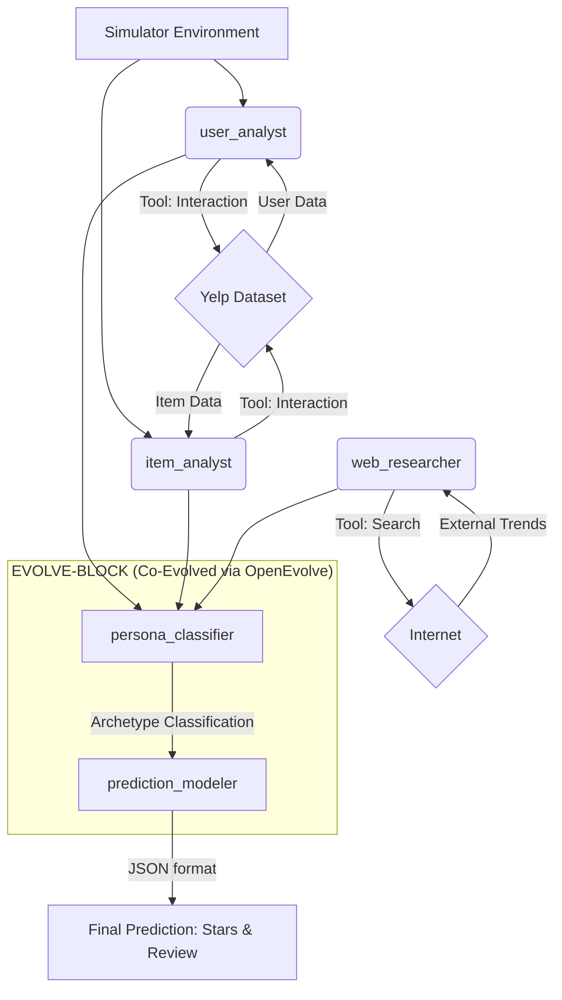

# OpenEvolve Final Project: Co-Evolutionary Yelp User Profiling Pipeline

## 1. Novelty Finding: Co-Evolving Classification & Prediction

Our core novelty lies in using OpenEvolve to **co-evolve two reasoning agents simultaneously**: a `persona_classifier` and a `prediction_modeler`. 

Instead of a monolithic prediction approach, we theorized that accurate predictions require first understanding *who* the user is. By placing both agents inside the `EVOLVE-BLOCK`, OpenEvolve discovers coordinated strategies where the classification schema (e.g., determining if a user is a "harsh critic" or "generous rater") and the downstream prediction logic become mutually consistent. This joint search space is far more expressive than single-agent evolution, leading to nuanced, archetype-anchored predictions that circumvent standard LLM positivity bias.

---

## 2. Crew Diagram & Collaboration Pattern

**Collaboration Pattern:** 
Our crew isolates tool-use from reasoning. Three robust external-facing agents (`user_analyst`, `item_analyst`, and `web_researcher`) gather all local database and real-time internet context. They pass this structured context into our evolutionary reasoning block. Here, the `persona_classifier` distills the data into a strict behavioral archetype, which the `prediction_modeler` uses as a mandatory calibration signal to generate the final review.

---

## 3. Agents Design

### Agent 1: Yelp User Profiler (`user_analyst`)
- **Role**: Yelp User Profiler
- **Goal**: Build an accurate behavioral profile for the user using exact lookup tools.
- **Backstory**: Senior behavioral data analyst specializing in Yelp platform dynamics. Interprets Yelp's unique data schema ('elite' years, 'compliment_hot', 'average_stars').
- **Tool Use**: **Interaction Tool Wrapper** (`query_type: user` and `review_by_user`).

### Agent 2: Yelp Restaurant Analyst (`item_analyst`)
- **Role**: Yelp Restaurant Analyst
- **Goal**: Build an accurate profile for the business using exact lookup tools.
- **Backstory**: Seasoned restaurant critic and business intelligence analyst. Interprets 'attributes' (WiFi, BusinessParking) and 'RestaurantsPriceRange2'.
- **Tool Use**: **Interaction Tool Wrapper** (`query_type: item` and `review_by_item`).

### Agent 3: External Trend Researcher (`web_researcher`)
- **Role**: External Trend Researcher
- **Goal**: Search the internet for real-time information, trends, and news about businesses or dining habits.
- **Backstory**: Expert at gathering external context from the web to supplement static local datasets.
- **Tool Use**: **Web Search Tool**.

### Agent 4: User Behavioral Persona Classifier (`persona_classifier`) - *[EVOLVED]*
- **Role**: User Behavioral Persona Classifier
- **Goal**: Analyze the user profile and classify them into exactly ONE archetype (e.g., HARSH_CRITIC, GENEROUS_RATER, BALANCED_REVIEWER, ELITE_CONNOISSEUR).
- **Backstory**: Consumer psychologist specializing in online review behavior. The prediction_modeler relies entirely on this archetype assignment to calibrate its rating estimate.
- **Tool Use**: None (Pure reasoning).

### Agent 5: Review Prediction Expert (`prediction_modeler`) - *[EVOLVED]*
- **Role**: Review Prediction Expert
- **Goal**: Predict the exact star rating and generate a mock review based on the provided persona classification.
- **Backstory**: Expert in behavioral simulation. Uses the archetype as the primary calibration signal (e.g., HARSH_CRITIC predictions anchor below the user's average_stars). Matches writing style authentically.
- **Tool Use**: None (Pure generation).

---

## 4. Evolution Analysis & Performance (Placeholder)

*(This section will be filled out once the OpenEvolve 50-iteration run is complete)*

- **Evolution Path & Checkpoints Analysis**: [To be added]
- **Gen-0 vs. Evolved Comparison**: [To be added]
- **Final Combined Score**: [To be added]
